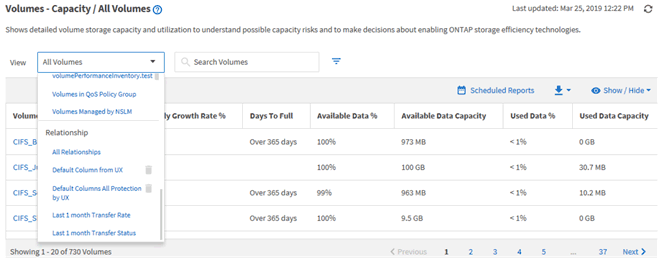

= 瞭解檢視與報告關係
:allow-uri-read: 
:icons: font
:imagesdir: ../media/

[role="lead"]
下載或排程時、檢視和庫存頁面會變成報告。

您可以自訂及儲存檢視和庫存頁面、以供重複使用。您幾乎可以在Unified Manager中檢視的所有內容、都可以儲存、重複使用、排程及分享為報告。

在檢視下拉式清單中、含有刪除圖示的項目是您或其他使用者所建立的現有自訂檢視。沒有圖示的項目是Unified Manager提供的預設檢視。無法修改或刪除預設檢視。

[NOTE]
====
如果您從清單中刪除自訂檢視、也會刪除任何使用該檢視的排程報告。如果您變更自訂檢視、使用該檢視的報告將會在下次產生報告時、根據報告排程以電子郵件傳送變更。

====

只有具有應用程式管理員或儲存管理員角色的使用者、才能看到刪除圖示、變更或刪除檢視、或變更或刪除排程的報告。
