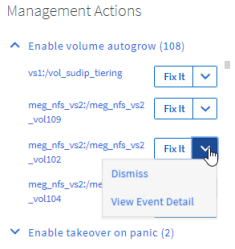

= 使用Unified Manager自動修正來修正問題
:allow-uri-read: 
:icons: font
:imagesdir: ../media/

[role="lead"]
Unified Manager可以徹底診斷某些事件、並提供單一解決方案。如果可用、這些解析度會顯示在儀表板、事件詳細資料頁面、以及左導覽功能表的工作負載分析選項中。

== 關於這項工作

大部分的事件都有各種可能的解析度、顯示在「事件詳細資料」頁面中、因此您可以使用ONTAP 「支援系統管理員」或ONTAP 「支援中心CLI」來實作最佳解決方案。

== 步驟

. 若要檢視可從*儀表板*修正的事件、請按一下*儀表板*。
+

. 若要解決Unified Manager可以解決的任何問題、請按一下「*修正*」按鈕。

