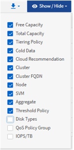
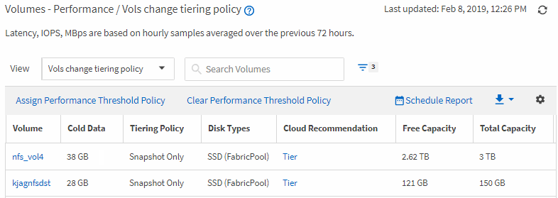
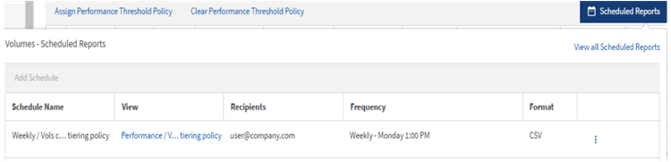

= 報告快速入門
:allow-uri-read: 
:icons: font
:imagesdir: ../media/

[role="lead"]
建立範例自訂報告、以體驗瀏覽檢視和排程報告的體驗。這份快速入門報告會找出您可能想要移至雲端層的磁碟區清單、因為有相當數量的非使用中（冷）資料。您將會開啟「效能：所有磁碟區」檢視、使用篩選器和欄自訂檢視、將自訂檢視儲存為報告、並將報告排程為每週共用一次。

== 開始之前

* 您必須具有應用程式管理員或儲存管理員角色。
* 您必須已設定FabricPool 好這些集合體的資料、並在這些集合體上有磁碟區。

== 關於這項工作

請依照下列步驟進行：

* 開啟預設檢視
* 透過篩選及排序資料來自訂欄位
* 儲存檢視
* 排程要為自訂檢視產生的報告

== 步驟

. 在左導覽窗格中、按一下「*儲存設備*>*磁碟區*」。
. 在「檢視」功能表中、選取「*效能*」>「*所有磁碟區*」。
. 按一下「顯示/隱藏」*以確定「磁碟類型」欄出現在檢視中。
+

+
新增或移除其他欄位、以建立包含報告重要欄位的檢視。

. 拖曳「Cloud Recommendation」（雲端建議）欄旁的「磁碟類型」欄。
. 按一下篩選圖示以新增下列三個篩選條件、然後按一下*套用篩選條件*：
+
** 磁碟類型包含FabricPool 了一些功能
** 雲端建議包含階層
** Cold資料大於10 GBimage:../media/filter-cold-data.gif[""]

+
請注意、每個篩選器都會以邏輯方式連接、因此所有傳回的磁碟區都必須符合所有條件。您最多可以新增5個篩選器。

. 按一下「* Cold Data*」欄的頂端、即可排序結果、使含有最冷資料的磁碟區顯示在檢視頂端。
. 自訂檢視時、檢視名稱為「未儲存的檢視」。命名檢視以反映檢視內容、例如「'Vols change tiering policy'」。完成後、按一下核取標記或按Enter以新名稱儲存檢視。
+

. 請下載* CSV*或* PDF*檔案格式的報告、以便在排程或分享之前查看輸出內容。
+
使用已安裝的應用程式（例如Microsoft Excel（CSV）或Adobe Acrobat（PDF）開啟檔案、或儲存檔案。

. 按一下目錄頁上的*排程報告*按鈕。與物件相關的所有排程報告（在此案例中為Volume）都會顯示在清單中。
+

. 按一下「*新增排程*」將新列新增至「*報告排程*」頁面、以便定義新報告的排程特性。
. 輸入報告名稱並填寫其他報告欄位、然後按一下核取標記（image:../media/blue-check.gif[""]）。
+
報告會立即以測試形式傳送。之後、報告會以電子郵件產生並傳送給使用指定頻率列出的收件者。

+
下列報告範例為CSV格式：

+
image::../media/csv-sample-report.gif[CSV範例報告]

+
下列報告範例為PDF格式：

+
image::../media/pdf-sample-report.gif[PDF範例報告]

== 完成後

根據報告中顯示的結果、您可能會想要使用ONTAP 支援功能的支援中心或ONTAP 支援功能的CLI、將特定磁碟區的分層原則變更為「自動」或「全部」、以便將更多的冷資料卸載到雲端層。
